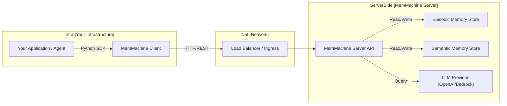
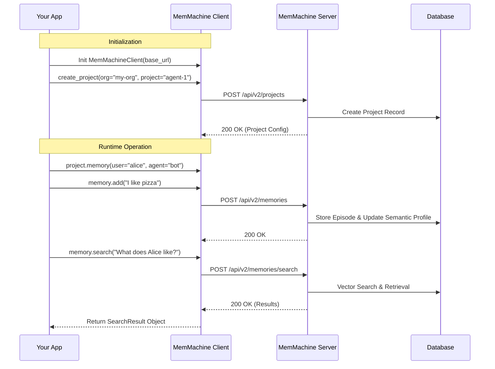

The **MemMachine Python Client SDK** provides a robust, type-safe interface for your applications to interact with the MemMachine Server. It handles the complexity of authentication, connection pooling, retries, and object serialization, allowing you to focus on building intelligent agents.

## Architecture

The MemMachine Client SDK acts as a bridge between your application logic (e.g., an AI agent, a chatbot, or a backend service) and the MemMachine Server.

### Communication Flow

The following diagram illustrates how the Client SDK integrates into your system architecture:



### Interaction Sequence

The standard workflow involves initializing the client, selecting a project, defining a memory context, and then performing operations.



## Installation

Install the client package via pip:

```bash
pip install memmachine
```

## Hello World Example

This complete example demonstrates the core workflow: connecting to the server, initializing a project workspace, and performing memory operations.

```python title="MemMachineClient Hello World" Expandable
import time
from memmachine import MemMachineClient

def main():
    # 1. Initialize the Client
    # Ensure your MemMachine server is running at this URL
    client = MemMachineClient(base_url="http://localhost:8080")

    # 2. Define a Project Workspace
    # Projects segregate data within an organization.
    # 'get_or_create_project' is idempotent; it returns the existing project if it exists.
    print("Initializing Project...")
    project = client.get_or_create_project(
        org_id="acme-corp",
        project_id="support-bot-v1",
        description="Memory store for customer support agent"
    )
    print(f"Connected to Project: {project.org_id}/{project.project_id}")

    # 3. Create a Context-Aware Memory Interface
    # This interface scopes all operations to a specific user and agent interaction.
    # - user_id: The end-user (human)
    # - agent_id: Your AI agent
    # - session_id: (Optional) A specific conversation thread
    memory = project.memory(
        user_id="alice_123",
        agent_id="support_bot_01",
        session_id="session_555"
    )

    # 4. Add Memories (Simulating a conversation)
    print("Adding memories...")
    
    # User states a preference
    memory.add(
        content="I am strictly vegetarian and I love spicy food.",
        role="user",
        metadata={"topic": "food_preference"}
    )
    
    # Agent acknowledges
    memory.add(
        content="Noted, I will recommend vegetarian spicy options.",
        role="assistant"
    )

    # 5. Search Memories
    # Retrieve relevant context for a new query
    print("\nSearching for context...")
    query = "What should I suggest for dinner?"
    results = memory.search(query)

    print(f"Query: {query}")
    print("Results found:")
    for idx, item in enumerate(results.get('episodic_memory', [])):
        print(f"[{idx+1}] {item['content']} (Role: {item['producer_role']})")

if __name__ == "__main__":
    main()
```

The expected output from running the above Hello World script should look like this:
```bash title="Hello World Expected Output"
python sample.py 
Initializing Project...
Connected to Project: acme-corp/support-bot-v1
Adding memories...

Searching for context...
Query: What should I suggest for dinner?
Results found:
[1] I am strictly vegetarian and I love spicy food. (Role: user)
[2] Noted, I will recommend vegetarian spicy options. (Role: assistant)
[3] I am strictly vegetarian and I love spicy food. (Role: user)
[4] Noted, I will recommend vegetarian spicy options. (Role: assistant)
```

## Core Concepts

### `MemMachineClient`
The entry point for the SDK. It manages the persistent HTTP session, connection pooling, and global configuration (like timeouts and retries).

**Key Parameters:**
- `base_url`: The URL of your MemMachine Server (e.g., `http://localhost:8080`).
- `api_key`: (Optional) Authentication token if your server requires it.
- `timeout`: Request timeout in seconds (default: 30).

### `Project`
A **Project** represents an isolated workspace. All data in MemMachine is siloed by `org_id` and `project_id`.
- Use `client.create_project()` to initialize or retrieve a project.
- Use `client.get_project()` to retrieve an existing project (raises error if not found).

### `Memory`
The **Memory** object is a transient interface bound to a specific *context*. It does not hold state itself but ensures that every operation (add, search, delete) is tagged with the correct metadata identifiers:
- `user_id`: The human user.
- `agent_id`: The AI agent.
- `group_id`: (Optional) A group identifier for multi-user contexts.
- `session_id`: (Optional) A specific session identifier.

**Key Methods:**
- `add(content, role, ...)`: Stores a new memory episode.
- `search(query, ...)`: Semantically searches for relevant memories.
- `delete()`: Deletes memories matching specific criteria.