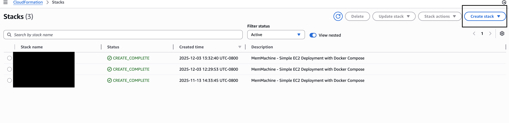
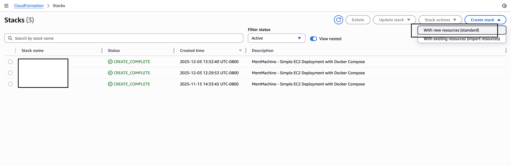
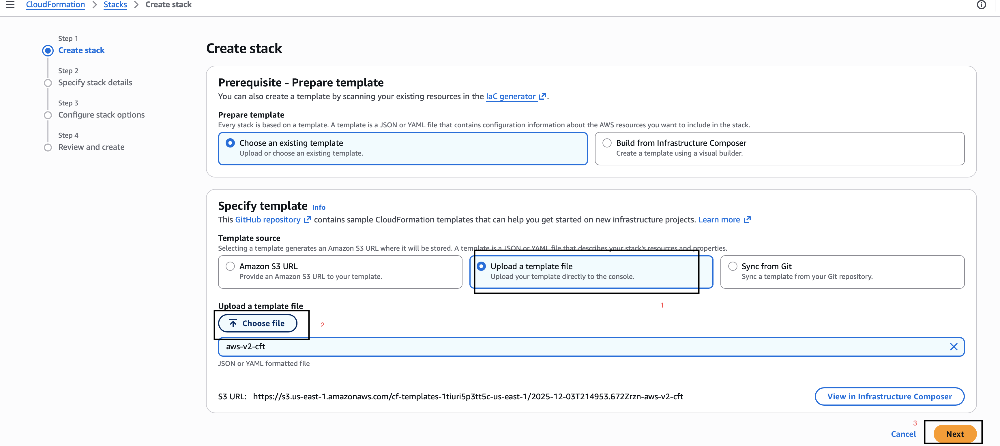
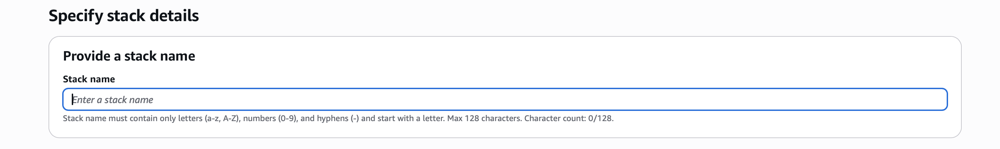
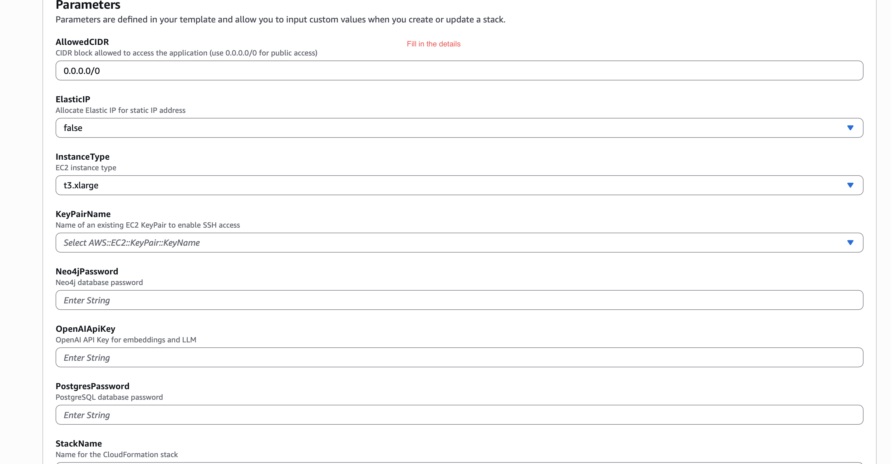
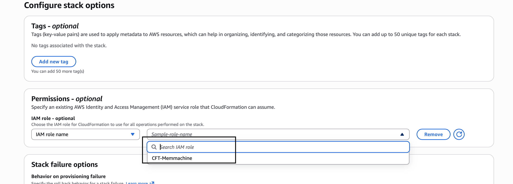
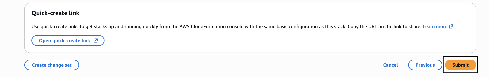
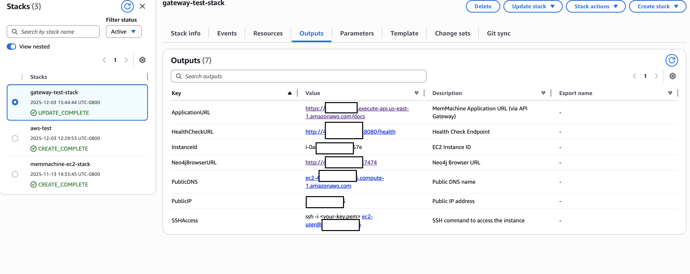
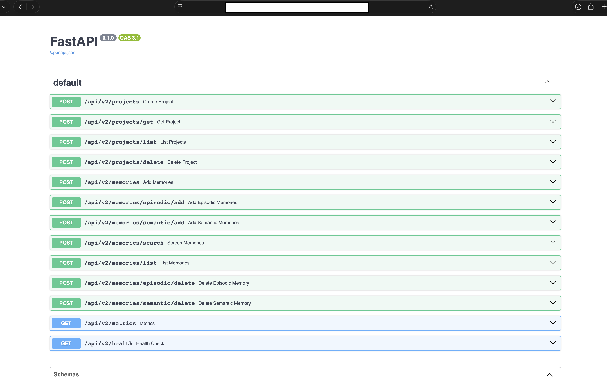

This single-click CloudFormation stack fully provisions a production-grade MemMachine environment on AWS. It automatically configures essential components such as the VPC, networking, security groups, EC2 instance with Docker, PostgreSQL/Neo4j databases, Network Load Balancer, and all necessary services and settings to run MemMachine reliably with your OpenAI API key.

## Prerequisites

Have the following available and ready:
1. **AWS Account** with appropriate permissions
2. **EC2 Key Pair**
	 - Fill out with your specific information.
```bash
aws ec2 describe-key-pairs 
  	--region us-east-1 aws ec2 create-key-pair \  
  	--key-name my-memmachine-key \  
  	--region us-east-1 \  
  	--query 'KeyMaterial' \  
  	--output text > my-memmachine-key.pem 
chmod 400 my-memmachine-key.pem
```

3. **OpenAI API Key** — required for embeddings.

4. **Determine `STACK_NAME`** 
    - you will need to use the same name for this parameter throughout deployment.  
    - You can call the file whatever you like.  In this example, we are using `memmachine-ec2-stack` or `your-stack-name`.  
<Note>If you choose to use a different name, make sure any reference to `memmachine-ec2-stack` or `your-stack-name`is replaced by your chosen stack name.</Note>

5. Cloud Formation Template - *see code block below*
    - Use the copy feature below and paste into your own file
	- Be sure to fill out witih your specific information where applicable

```yaml expandable
AWSTemplateFormatVersion: '2010-09-09'
Description: 'MemMachine - Simple EC2 Deployment with Docker Compose'

Parameters:
  StackName:
    Type: String
    Default: memmachine-ec2-stack
    Description: Name for the CloudFormation stack
  
  InstanceType:
    Type: String
    Default: t3.xlarge
    AllowedValues: [t3.medium, t3.large, t3.xlarge, t3.2xlarge, m5.large, m5.xlarge, m5.2xlarge]
    Description: EC2 instance type
  
  KeyPairName:
    Type: AWS::EC2::KeyPair::KeyName
    Description: Name of an existing EC2 KeyPair to enable SSH access
  
  PostgresPassword:
    Type: String
    NoEcho: true
    MinLength: 8
    Description: PostgreSQL database password
  
  Neo4jPassword:
    Type: String
    NoEcho: true
    MinLength: 8
    Description: Neo4j database password
  
  OpenAIApiKey:
    Type: String
    NoEcho: true
    Description: OpenAI API Key for embeddings and LLM
  
  AllowedCIDR:
    Type: String
    Default: 0.0.0.0/0
    Description: CIDR block allowed to access the application (use 0.0.0.0/0 for public access)

Resources:
  # VPC
  VPC:
    Type: AWS::EC2::VPC
    Properties:
      CidrBlock: 10.0.0.0/16
      EnableDnsHostnames: true
      EnableDnsSupport: true
      Tags:
        - Key: Name
          Value: !Sub '${StackName}-vpc'
  
  InternetGateway:
    Type: AWS::EC2::InternetGateway
    Properties:
      Tags:
        - Key: Name
          Value: !Sub '${StackName}-igw'
  
  InternetGatewayAttachment:
    Type: AWS::EC2::VPCGatewayAttachment
    Properties:
      InternetGatewayId: !Ref InternetGateway
      VpcId: !Ref VPC
  
  # Public Subnet
  PublicSubnet:
    Type: AWS::EC2::Subnet
    Properties:
      VpcId: !Ref VPC
      AvailabilityZone: !Select [0, !GetAZs '']
      CidrBlock: 10.0.0.0/24
      MapPublicIpOnLaunch: true
      Tags:
        - Key: Name
          Value: !Sub '${StackName}-public-subnet'
  
  PublicSubnet2:
    Type: AWS::EC2::Subnet
    Properties:
      VpcId: !Ref VPC
      AvailabilityZone: !Select [1, !GetAZs '']
      CidrBlock: 10.0.1.0/24
      MapPublicIpOnLaunch: true
      Tags:
        - Key: Name
          Value: !Sub '${StackName}-public-subnet-2'
  
  # Route Table
  PublicRouteTable:
    Type: AWS::EC2::RouteTable
    Properties:
      VpcId: !Ref VPC
      Tags:
        - Key: Name
          Value: !Sub '${StackName}-public-routes'
  
  DefaultPublicRoute:
    Type: AWS::EC2::Route
    DependsOn: InternetGatewayAttachment
    Properties:
      RouteTableId: !Ref PublicRouteTable
      DestinationCidrBlock: 0.0.0.0/0
      GatewayId: !Ref InternetGateway
  
  PublicSubnetRouteTableAssociation:
    Type: AWS::EC2::SubnetRouteTableAssociation
    Properties:
      RouteTableId: !Ref PublicRouteTable
      SubnetId: !Ref PublicSubnet
  
  PublicSubnet2RouteTableAssociation:
    Type: AWS::EC2::SubnetRouteTableAssociation
    Properties:
      RouteTableId: !Ref PublicRouteTable
      SubnetId: !Ref PublicSubnet2
  
  # Security Group
  MemMachineSecurityGroup:
    Type: AWS::EC2::SecurityGroup
    Properties:
      GroupName: !Sub '${StackName}-sg'
      GroupDescription: Security group for MemMachine EC2 instance
      VpcId: !Ref VPC
      SecurityGroupIngress:
        - IpProtocol: tcp
          FromPort: 22
          ToPort: 22
          CidrIp: !Ref AllowedCIDR
          Description: SSH access
        - IpProtocol: tcp
          FromPort: 8080
          ToPort: 8080
          CidrIp: 10.0.0.0/16
          Description: MemMachine API from VPC only
        - IpProtocol: tcp
          FromPort: 7474
          ToPort: 7474
          CidrIp: !Ref AllowedCIDR
          Description: Neo4j HTTP
        - IpProtocol: tcp
          FromPort: 7687
          ToPort: 7687
          CidrIp: !Ref AllowedCIDR
          Description: Neo4j Bolt
      SecurityGroupEgress:
        - IpProtocol: -1
          CidrIp: 0.0.0.0/0
      Tags:
        - Key: Name
          Value: !Sub '${StackName}-sg'
  
  # IAM Role for EC2
  EC2Role:
    Type: AWS::IAM::Role
    Properties:
      RoleName: !Sub '${StackName}-ec2-role'
      AssumeRolePolicyDocument:
        Version: '2012-10-17'
        Statement:
          - Effect: Allow
            Principal:
              Service: ec2.amazonaws.com
            Action: sts:AssumeRole
      ManagedPolicyArns:
        - arn:aws:iam::aws:policy/AmazonSSMManagedInstanceCore
      Policies:
        - PolicyName: CloudWatchLogs
          PolicyDocument:
            Version: '2012-10-17'
            Statement:
              - Effect: Allow
                Action:
                  - logs:CreateLogGroup
                  - logs:CreateLogStream
                  - logs:PutLogEvents
                  - logs:DescribeLogStreams
                Resource: '*'
  
  EC2InstanceProfile:
    Type: AWS::IAM::InstanceProfile
    Properties:
      Roles:
        - !Ref EC2Role
  
  # CloudWatch Log Group
  MemMachineLogGroup:
    Type: AWS::Logs::LogGroup
    Properties:
      LogGroupName: !Sub '/memmachine/${StackName}'
      RetentionInDays: 30


  MemMachineNLB:
    Type: AWS::ElasticLoadBalancingV2::LoadBalancer
    Properties:
      Name: !Sub '${StackName}-nlb'
      Type: network
      Scheme: internal
      Subnets:
        - !Ref PublicSubnet
        - !Ref PublicSubnet2

  MemMachineTargetGroup:
    Type: AWS::ElasticLoadBalancingV2::TargetGroup
    Properties:
      Name: !Sub '${StackName}-tg'
      Port: 8080
      Protocol: TCP
      TargetType: instance
      VpcId: !Ref VPC
      HealthCheckPort: '8080'
      HealthCheckProtocol: TCP
      Targets:
        - Id: !Ref MemMachineInstance
          Port: 8080

  MemMachineNLBListener:
    Type: AWS::ElasticLoadBalancingV2::Listener
    Properties:
      DefaultActions:
        - Type: forward
          TargetGroupArn: !Ref MemMachineTargetGroup
      LoadBalancerArn: !Ref MemMachineNLB
      Port: 8080
      Protocol: TCP

  MemMachineVpcLink:
    Type: AWS::ApiGatewayV2::VpcLink
    Properties:
      Name: !Sub '${StackName}-vpclink'
      SubnetIds:
        - !Ref PublicSubnet
        - !Ref PublicSubnet2

  MemMachineHttpApi:
    Type: AWS::ApiGatewayV2::Api
    Properties:
      Name: !Sub '${StackName}-http-api'
      ProtocolType: HTTP

  MemMachineIntegration:
    Type: AWS::ApiGatewayV2::Integration
    Properties:
      ApiId: !Ref MemMachineHttpApi
      IntegrationType: HTTP_PROXY
      IntegrationMethod: ANY
      ConnectionType: VPC_LINK
      ConnectionId: !Ref MemMachineVpcLink
      IntegrationUri: !Ref MemMachineNLBListener
      PayloadFormatVersion: '1.0'

  MemMachineRoute:
    Type: AWS::ApiGatewayV2::Route
    Properties:
      ApiId: !Ref MemMachineHttpApi
      RouteKey: 'ANY /{proxy+}'
      Target: !Sub 'integrations/${MemMachineIntegration}'

  MemMachineStage:
    Type: AWS::ApiGatewayV2::Stage
    Properties:
      ApiId: !Ref MemMachineHttpApi
      StageName: '$default'
      AutoDeploy: true

  MemMachineInstance:
    Type: AWS::EC2::Instance
    Properties:
      ImageId: !Sub '{{resolve:ssm:/aws/service/ami-amazon-linux-latest/amzn2-ami-hvm-x86_64-gp2}}'
      InstanceType: !Ref InstanceType
      KeyName: !Ref KeyPairName
      SubnetId: !Ref PublicSubnet
      SecurityGroupIds:
        - !Ref MemMachineSecurityGroup
      IamInstanceProfile: !Ref EC2InstanceProfile
      UserData:
        Fn::Base64: !Sub |
          #!/bin/bash
          set -e
          
          # Update system
          yum update -y
          
          # Install CloudFormation helper scripts
          yum install -y aws-cfn-bootstrap
          
          # Install Docker
          yum install -y docker
          systemctl start docker
          systemctl enable docker
          usermod -a -G docker ec2-user
          
          # Install Docker Compose
          curl -L "https://github.com/docker/compose/releases/latest/download/docker-compose-$(uname -s)-$(uname -m)" -o /usr/local/bin/docker-compose
          chmod +x /usr/local/bin/docker-compose
          ln -s /usr/local/bin/docker-compose /usr/bin/docker-compose
          
          # Install Git
          yum install -y git
          
          # Create application directory
          mkdir -p /opt/memmachine
          cd /opt/memmachine
          
          # Create docker-compose.yml
          cat > docker-compose.yml << 'COMPOSEEOF'
          services:
            postgres:
              image: pgvector/pgvector:pg16
              container_name: memmachine-postgres
              restart: unless-stopped
              ports:
                - "5432:5432"
              environment:
                POSTGRES_DB: memmachine
                POSTGRES_USER: memmachine
                POSTGRES_PASSWORD: POSTGRES_PASSWORD_PLACEHOLDER
                POSTGRES_INITDB_ARGS: "--encoding=UTF-8 --lc-collate=C --lc-ctype=C"
              volumes:
                - postgres_data:/var/lib/postgresql/data
              healthcheck:
                test: ["CMD-SHELL", "pg_isready -U memmachine -d memmachine"]
                interval: 10s
                timeout: 5s
                retries: 5
                start_period: 30s
              networks:
                - memmachine-network

            neo4j:
              image: neo4j:5.23-community
              container_name: memmachine-neo4j
              restart: unless-stopped
              ports:
                - "7474:7474"
                - "7473:7473"
                - "7687:7687"
              environment:
                NEO4J_EDITION: community
                NEO4J_AUTH: neo4j/NEO4J_PASSWORD_PLACEHOLDER
                NEO4J_server_bolt_thread__pool__max__size: 2000
                NEO4J_server_memory_heap_initial__size: 512m
                NEO4J_server_memory_heap_max__size: 1G
                NEO4J_server_default__listen__address: 0.0.0.0
                NEO4J_server_bolt_listen__address: 0.0.0.0:7687
                NEO4J_server_http_listen__address: 0.0.0.0:7474
                NEO4J_server_https_listen__address: 0.0.0.0:7473
                NEO4J_PLUGINS: '["apoc", "graph-data-science"]'
              volumes:
                - neo4j_data:/data
                - neo4j_logs:/logs
                - neo4j_import:/var/lib/neo4j/import
                - neo4j_plugins:/plugins
              healthcheck:
                test: ["CMD", "cypher-shell", "-u", "neo4j", "-p", "NEO4J_PASSWORD_PLACEHOLDER", "RETURN 1"]
                interval: 30s
                timeout: 10s
                retries: 5
                start_period: 30s
              networks:
                - memmachine-network

            memmachine:
              image: public.ecr.aws/v3z9g9t6/memmachine-v2:latest-cpu
              container_name: memmachine-app
              restart: unless-stopped
              ports:
                - "8080:8080"
              environment:
                POSTGRES_HOST: postgres
                POSTGRES_PORT: 5432
                POSTGRES_USER: memmachine
                POSTGRES_PASSWORD: POSTGRES_PASSWORD_PLACEHOLDER
                POSTGRES_DB: memmachine
                NEO4J_HOST: neo4j
                NEO4J_PORT: 7687
                NEO4J_USER: neo4j
                NEO4J_PASSWORD: NEO4J_PASSWORD_PLACEHOLDER
                MEMORY_CONFIG: /app/configuration.yml
                MCP_BASE_URL: http://localhost:8080
                GATEWAY_URL: http://localhost:8080
                FAST_MCP_LOG_LEVEL: INFO
                OPENAI_API_KEY: OPENAI_API_KEY_PLACEHOLDER
                LOG_LEVEL: INFO
              volumes:
                - memmachine_logs:/tmp/memory_logs
              depends_on:
                postgres:
                  condition: service_healthy
                neo4j:
                  condition: service_healthy
              healthcheck:
                test: ["CMD", "curl", "--fail", "--silent", "http://localhost:8080/api/v2/health"]
                interval: 30s
                timeout: 10s
                retries: 3
                start_period: 60s
              networks:
                - memmachine-network

          volumes:
            postgres_data:
            neo4j_data:
            neo4j_logs:
            neo4j_import:
            neo4j_plugins:
            memmachine_logs:

          networks:
            memmachine-network:
              driver: bridge
          COMPOSEEOF
          
          # Replace password placeholders in docker-compose.yml
          sed -i "s|POSTGRES_PASSWORD_PLACEHOLDER|${PostgresPassword}|g" docker-compose.yml
          sed -i "s|NEO4J_PASSWORD_PLACEHOLDER|${Neo4jPassword}|g" docker-compose.yml
          sed -i "s|OPENAI_API_KEY_PLACEHOLDER|${OpenAIApiKey}|g" docker-compose.yml
          
          # Create .env file with actual values
          cat > .env << 'ENVEOF'
          POSTGRES_PASSWORD=PLACEHOLDER_POSTGRES
          NEO4J_PASSWORD=PLACEHOLDER_NEO4J
          OPENAI_API_KEY=PLACEHOLDER_OPENAI
          ENVEOF
          
          # Replace placeholders with actual values
          sed -i "s|PLACEHOLDER_POSTGRES|${PostgresPassword}|g" .env
          sed -i "s|PLACEHOLDER_NEO4J|${Neo4jPassword}|g" .env
          sed -i "s|PLACEHOLDER_OPENAI|${OpenAIApiKey}|g" .env
          
          # Create configuration.yml file with actual values (using proper YAML escaping)
          cat > configuration.yml << 'CONFIGEOF'
          logging:
            path: mem-machine.log
            level: info #| debug | error

          episode_store:
            database: profile_storage

          episodic_memory:
            long_term_memory:
              embedder: openai_embedder
              reranker: my_reranker_id
              vector_graph_store: my_storage_id
            short_term_memory:
              llm_model: openai_model
              message_capacity: 500

          semantic_memory:
            llm_model: openai_model
            embedding_model: openai_embedder
            database: profile_storage

          session_manager:
            database: profile_storage

          prompt:
            session:
            - profile_prompt


          resources:
            databases:
              profile_storage:
                provider: postgres
                config:
                  host: postgres
                  port: 5432
                  user: memmachine
                  password: POSTGRES_PASSWORD_PLACEHOLDER
                  db_name: memmachine
              my_storage_id:
                provider: neo4j
                config:
                  uri: 'bolt://neo4j:7687'
                  username: neo4j
                  password: NEO4J_PASSWORD_PLACEHOLDER
              sqlite_test:
                provider: sqlite
                config:
                  path: sqlite_test.db
            embedders:
              openai_embedder:
                provider: openai
                config:
                  model: "text-embedding-3-small"
                  api_key: OPENAI_API_KEY_PLACEHOLDER
                  base_url: "https://api.openai.com/v1"
                  dimensions: 1536
            language_models:
              openai_model:
                provider: openai-responses
                config:
                  model: "gpt-4o-mini"
                  api_key: OPENAI_API_KEY_PLACEHOLDER
                  base_url: "https://api.openai.com/v1"
            rerankers:
              my_reranker_id:
                provider: "rrf-hybrid"
                config:
                  reranker_ids:
                    - id_ranker_id
                    - bm_ranker_id
              id_ranker_id:
                provider: "identity"
              bm_ranker_id:
                provider: "bm25"

          CONFIGEOF
          
          # Replace placeholders in configuration.yml (using proper escaping for sed)
          sed -i "s|OPENAI_API_KEY_PLACEHOLDER|$(echo '${OpenAIApiKey}' | sed 's/[[\.*^$()+?{|]/\\&/g')|g" configuration.yml
          sed -i "s|NEO4J_PASSWORD_PLACEHOLDER|$(echo '${Neo4jPassword}' | sed 's/[[\.*^$()+?{|]/\\&/g')|g" configuration.yml
          sed -i "s|POSTGRES_PASSWORD_PLACEHOLDER|$(echo '${PostgresPassword}' | sed 's/[[\.*^$()+?{|]/\\&/g')|g" configuration.yml
          
          # Update docker-compose.yml to mount configuration.yml
          sed -i '/memmachine_logs:\/tmp\/memory_logs/a\      - .\/configuration.yml:\/app\/configuration.yml:ro' docker-compose.yml
          
          # Start services
          docker-compose up -d
          
          # Wait for services to be healthy
          echo "Waiting for services to start..."
          sleep 30
          
          # Log status
          docker-compose ps >> /var/log/memmachine-startup.log 2>&1
          
          # Send completion signal to CloudFormation
          /opt/aws/bin/cfn-signal -e $? --stack ${AWS::StackName} --resource MemMachineInstance --region ${AWS::Region} || true
      Tags:
        - Key: Name
          Value: !Sub '${StackName}-instance'

Outputs:
    InstanceId:
        Description: EC2 Instance ID
        Value: !Ref MemMachineInstance

    PublicIP:
        Description: Public IP address
        Value: !GetAtt MemMachineInstance.PublicIp

    PublicDNS:
        Description: Public DNS name
        Value: !GetAtt MemMachineInstance.PublicDnsName

    ApplicationURL:
        Description: MemMachine Application URL (via API Gateway)
        Value: !Sub 'https://${MemMachineHttpApi}.execute-api.${AWS::Region}.amazonaws.com/docs'

    HealthCheckURL:
        Description: Health Check Endpoint
        Value: !Sub 'http://${MemMachineInstance.PublicIp}:8080/api/v2/health'

    Neo4jBrowserURL:
        Description: Neo4j Browser URL
        Value: !Sub 'http://${MemMachineInstance.PublicIp}:7474'

    SSHAccess:
        Description: SSH command to access the instance
        Value: !Sub 'ssh -i <your-key.pem> ec2-user@${MemMachineInstance.PublicIp}'
```

## Deployment Methods
<Tabs>
<Tab title="Method 1: AWS CLI">
**Prerequisites**:

1. **AWS CLI** installed and configured
- To check your version, use the following commands:
```bash
aws --version
```	
- **macOS:** `brew install awscli`
- **Linux:** [AWS CLI Installation Guide](https://aws.amazon.com/cli/)

2. **AWS Credentials Configuration**:
```bash
  aws configure 
    # Enter: 
    # AWS Access Key ID 
    # AWS Secret Access Key 
    # Default region (e.g., us-east-1) 
    # Default output format (json) 
  aws sts get-caller-identity
```
**Process**:
<Note>Make sure to replace `your-cft-template.yaml` , `your-stack-name` and `your-key-pair` with the values you are using.</Note>
<Steps>
<Step title="Set Parameters">

```bash
aws configure
    STACK_NAME="your-stack-name" 
    REGION="us-east-1" 
    KEY_PAIR="your-key-pair" 
    POSTGRES_PASSWORD="YourSecurePassword123" 
    NEO4J_PASSWORD="YourSecurePassword123" 
    OPENAI_API_KEY="sk-your-openai-key-here" 
    INSTANCE_TYPE="t3.xlarge" 
    ELASTIC_IP="false" 
    ALLOWED_CIDR="0.0.0.0/0"
```
</Step>
<Step title="Deploy Stack">

```bash
aws cloudformation create-stack \
    --stack-name $STACK_NAME \
    --template-body file://your-cft-template.yaml \
    --parameters ParameterKey=StackName,ParameterValue=$STACK_NAME \
                 ParameterKey=InstanceType,ParameterValue=$INSTANCE_TYPE \
                 ParameterKey=KeyPairName,ParameterValue=$_KEY_PAIR \
                 ParameterKey=PostgresPassword,ParameterValue=$POSTGRES_PASSWORD \
                 ParameterKey=Neo4jPassword,ParameterValue=$NEO4J_PASSWORD \
                 ParameterKey=OpenAIApiKey,ParameterValue=$OPENAI_API_KEY \
                 ParameterKey=AllowedCIDR,ParameterValue=$_ALLOWED_CIDR \
                 ParameterKey=ElasticIP,ParameterValue=$_ELASTIC_IP \
    --capabilities CAPABILITY_NAMED_IAM \
    --region $REGION
```
</Step>
<Step title="Monitor Stack">

```bash
aws cloudformation describe-stacks \
   --stack-name $STACK_NAME 
   --region $REGION 
   --query 'Stacks[0].StackStatus' 
   --output text aws cloudformation wait stack-create-complete \  
   --stack-name $STACK_NAME --region $REGION
```
</Step>
<Step title="Retrieve Outputs">

```bash
aws cloudformation describe-stacks \
	--stack-name $STACK_NAME 
	--region $REGION 
	--query 'Stacks[0].Outputs' 
	--output table
```
**Expected Outputs include:**

- `ApplicationURL`
- `HealthCheckURL`
- `instanceID`
- `PublicIP`
- `SSHAccess`
- `Neo4jBrowserURL`
</Step>
<Step title="Test Application">
```bash
PUBLIC_IP=$(aws cloudformation describe-stacks \
	--stack-name $STACK_NAME \  
	--region $REGION \  
	--query 'Stacks[0].Outputs[?OutputKey==`PublicIP`].OutputValue' \  
	--output text) sleep 30 curl http://$PUBLIC_IP:8080/health`
```
</Step>
</Steps>
</Tab>

<Tab title="Method 2: AWS Console GUI">

Follow these steps to deploy the MemMachine CloudFormation stack entirely through the AWS Console.

<Steps>
<Step title="Open CloudFormation Console">

A. Go to **AWS Console → CloudFormation**



B. Click **Create stack → With new resources (standard)**


</Step>
<Step title="Upload your prepared template file">
1. Under **Prerequisite - Prepare template**, choose **Upload a template file**
2. Click **Choose file** and select your `memmachine-cft.yaml`
3. Click **Next**


</Step>
<Step title="Enter Stack Details">

A. **Stack name** → `memmachine-ec2-stack`

   

B. Fill all required parameters:

   - `AllowedCIDR` → `0.0.0.0/0`
   - `ElasticIP` → `false`
   - `InstanceType` → `t3.xlarge`
   - `KeyPairName` → select your EC2 key pair
   - `PostgresPassword`
   - `Neo4jPassword`
   - `OpenAIApiKey`



</Step>
<Step title="Configure Stack Options">

A. Scroll to **Permissions**
B. If you have a CloudFormation IAM role (e.g., `CFT-memmachine`), select it
C. Otherwise create an **IAM role** for **Cloud Formation**
D. Click **Next**



</Step>
<Step title="Review and Create">

A. Scroll down
B. Check the box **Acknowledge IAM resource creation**
C. Click **Submit**



</Step>

<Step title="Wait for CREATE_COMPLETE">

The stack will take a few minutes to finish.

Go to **AWS CloudFormation Console** → https://console.aws.amazon.com/cloudformation

You will see:
**Status → CREATE_COMPLETE**
</Step>
<Step title="Open Outputs">

Click the **Outputs** tab to see all auto-generated URLs:

You will get:

- **ApplicationURL** → FastAPI `/docs`
- **HealthCheckURL** → `/health`
- **InstanceId**
- **Neo4jBrowserURL**
- **PublicIP**
- **PublicDNS**
- **SSHAccess**



</Step>
<Step title="Test the API">

Open:

###  **MemMachine API Docs**

<CodeBlock language="URL">
https://(YOUR_API).execute-api.us-east-1.amazonaws.com/docs
</CodeBlock>


</Step>
</Steps>
</Tab>
</Tabs>