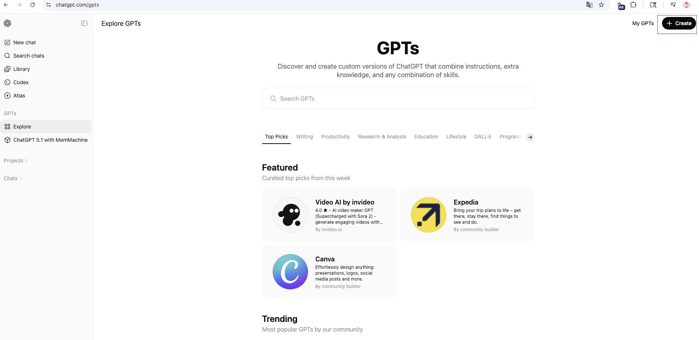
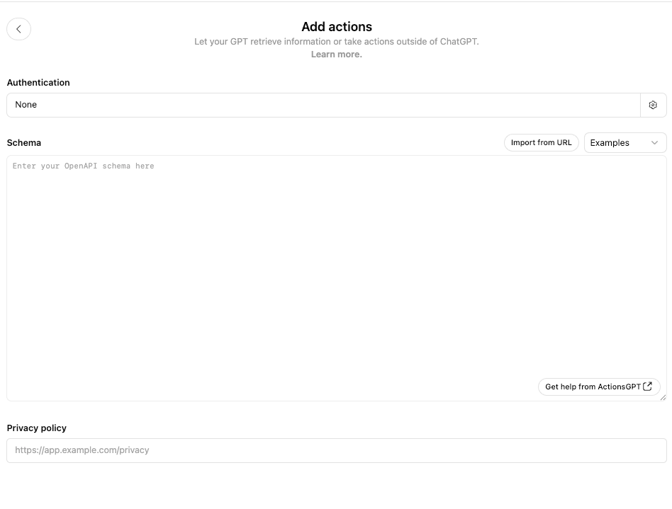
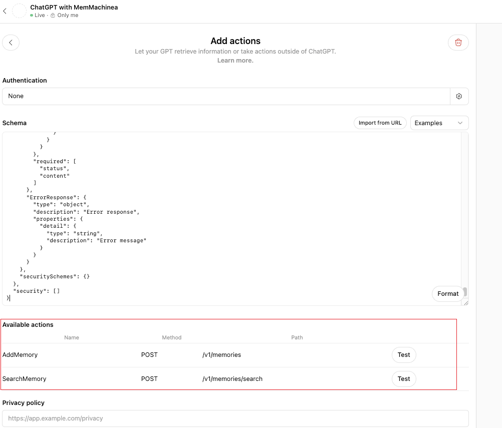

This guide walks you through creating a custom GPT in the OpenAI GPT Store and connecting it with MemMachine.

---

## **1. Open the GPT Store**

Go to:

**[https://chatgpt.com/gpts](https://chatgpt.com/gpts)**

You will see a page like this:



Click **Create** to start building your custom GPT.

---


## **2. Basic GPT Setup**

See the configuration page reference below:


Fill in the required fields:

### **Name**

```
ChatGPT with MemMachine
```

### **Description**

```
I am an intelligent assistant with long-term memory powered by MemMachine.
```

### **Instructions**

Copy the following:

```
You MUST actively use memory on EVERY message to provide personalized responses.

## CRITICAL: Session Values - MUST USE EXACTLY AS SHOWN

When calling SearchMemory or AddMemory, you MUST ALWAYS use these EXACT session values:

{
  "group_id": "YourName",
  "user_id": ["YourName"],
  "session_id": "YourName",
  "agent_id": ["YourName"]
}

Also use these exact values:
- producer: "YourName"
- produced_for: "YourName"

## CRITICAL: Memory Operations on EVERY Message

On EVERY user message, you MUST:

1. ALWAYS start by searching memories (SearchMemory):
   - Search for relevant past information based on the user's new message
   - Use the results to understand context, preferences, history, long-term facts

2. ALWAYS respond naturally using the retrieved memories:
   - Do NOT mention "searching memory"
   - Use context naturally in your reply

3. ALWAYS store new information (AddMemory):
   - Store any new facts, preferences, goals, or plans the user shares
```

You can replace `"YourName"` with any test user ID you want.

---

## **3. Enable Capabilities**

Scroll to **Capabilities** and enable:

* **Code Interpreter & Data Analysis**

---

## **4. Add MemMachine Action**

Click:

**Create new action**

You will see this page:



In the **Schema** field, paste the following content:

---

### **OpenAPI Schema (MemMachine)**

```
{
  "openapi": "3.1.0",
  "info": {
    "title": "MemMachine Memory API",
    "description": "API for storing and retrieving long-term memories. Use this to remember important information about users across conversations. Automatically stores memories in both episodic memory (conversation history) and profile memory (long-term user traits and facts).",
    "version": "v1.0.0"
  },
  "servers": [
    {
      "url": "A HTTPS URL hosting MemMachine",
      "description": "MemMachine API server"
    }
  ],
  "paths": {
    "/v1/memories": {
      "post": {
        "description": "CRITICAL: Use this on EVERY message to store new information. Automatically store any new facts, preferences, plans, or details the user shares. Include full context in episode_content. This ensures future conversations have complete context.",
        "summary": "Store a new memory",
        "operationId": "AddMemory",
        "x-openai-isConsequential": false,
        "requestBody": {
          "required": true,
          "content": {
            "application/json": {
              "schema": {
                "$ref": "#/components/schemas/MemoryInput"
              }
            }
          }
        },
        "responses": {
          "200": {
            "description": "Memory successfully stored",
            "content": {
              "application/json": {
                "schema": {
                  "type": "object",
                  "properties": {
                    "status": {
                      "type": "integer",
                      "description": "Status code (0 for success)",
                      "example": 0
                    }
                  }
                }
              }
            }
          },
          "400": {
            "description": "Bad request - invalid producer or produced_for ID",
            "content": {
              "application/json": {
                "schema": {
                  "$ref": "#/components/schemas/ErrorResponse"
                }
              }
            }
          },
          "404": {
            "description": "No matching episodic memory instance found",
            "content": {
              "application/json": {
                "schema": {
                  "$ref": "#/components/schemas/ErrorResponse"
                }
              }
            }
          },
          "500": {
            "description": "Internal server error",
            "content": {
              "application/json": {
                "schema": {
                  "$ref": "#/components/schemas/ErrorResponse"
                }
              }
            }
          }
        },
        "deprecated": false
      }
    },
    "/v1/memories/search": {
      "post": {
        "description": "CRITICAL: Use this on EVERY message to retrieve context. Always search for relevant past information before responding. This searches both profile memory (long-term user traits) and episodic memory (past conversations) to provide personalized responses.",
        "summary": "Search memories",
        "operationId": "SearchMemory",
        "x-openai-isConsequential": false,
        "requestBody": {
          "required": true,
          "content": {
            "application/json": {
              "schema": {
                "$ref": "#/components/schemas/SearchInput"
              }
            }
          }
        },
        "responses": {
          "200": {
            "description": "Search results returned successfully",
            "content": {
              "application/json": {
                "schema": {
                  "$ref": "#/components/schemas/SearchResult"
                }
              }
            }
          },
          "400": {
            "description": "Bad request",
            "content": {
              "application/json": {
                "schema": {
                  "$ref": "#/components/schemas/ErrorResponse"
                }
              }
            }
          },
          "404": {
            "description": "No matching episodic memory instance found",
            "content": {
              "application/json": {
                "schema": {
                  "$ref": "#/components/schemas/ErrorResponse"
                }
              }
            }
          },
          "500": {
            "description": "Internal server error",
            "content": {
              "application/json": {
                "schema": {
                  "$ref": "#/components/schemas/ErrorResponse"
                }
              }
            }
          }
        },
        "deprecated": false
      }
    }
  },
  "components": {
    "schemas": {
      "MemoryInput": {
        "type": "object",
        "description": "Input for storing a new memory",
        "properties": {
          "session": {
            "$ref": "#/components/schemas/SessionData",
            "description": "Session context. Fixed values are required."
          },
          "producer": {
            "type": "string",
            "default": "patient_001",
            "description": "The ID of the entity that produced the content (usually the user ID). Must be 'patient_001'.",
            "example": "patient_001"
          },
          "produced_for": {
            "type": "string",
            "default": "patient_001",
            "description": "The ID of the entity the content was produced for (usually 'patient_001' or the agent ID). Must be 'patient_001'.",
            "example": "patient_001"
          },
          "episode_content": {
            "type": "string",
            "description": "The memory content to store. Include full context - not just a snippet. Always prepend with current date in YYYY-MM-DD format if you know the user's timezone, UTC otherwise.",
            "example": "2024-11-04: User prefers Python over JavaScript for backend development"
          },
          "episode_type": {
            "type": "string",
            "description": "Type of memory: 'message' (conversation), 'preference' (user preference), 'fact' (factual information), 'goal' (user goal), etc.",
            "default": "message",
            "example": "preference"
          },
          "metadata": {
            "type": "object",
            "description": "Optional metadata",
            "additionalProperties": true,
            "default": {}
          }
        },
        "required": [
          "session",
          "producer",
          "produced_for",
          "episode_content",
          "episode_type"
        ],
        "additionalProperties": true
      },
      "SearchInput": {
        "type": "object",
        "description": "Input for searching memories",
        "properties": {
          "session": {
            "$ref": "#/components/schemas/SessionData",
            "description": "Session context. Fixed values are required."
          },
          "query": {
            "type": "string",
            "description": "Natural language query to search for relevant memories",
            "example": "user preferences about programming languages"
          },
          "limit": {
            "type": "integer",
            "description": "Maximum number of results to return. Default is 5.",
            "default": 5,
            "minimum": 1,
            "maximum": 50
          },
          "filter": {
            "type": "object",
            "description": "Optional filters for episodic/profile memory",
            "additionalProperties": true,
            "nullable": true
          }
        },
        "required": [
          "session",
          "query"
        ],
        "additionalProperties": true
      },
      "SessionData": {
        "type": "object",
        "description": "Session context (fixed to a single identity). MUST use: group_id='patient_001', user_id=['patient_001'], session_id='patient_001', agent_id=['patient_001'].",
        "properties": {
          "group_id": {
            "type": "string",
            "const": "patient_001",
            "default": "patient_001",
            "description": "Fixed group ID."
          },
          "user_id": {
            "type": "array",
            "minItems": 1,
            "maxItems": 1,
            "default": [
              "patient_001"
            ],
            "items": {
              "type": "string",
              "const": "patient_001"
            },
            "description": "Fixed user list with a single value."
          },
          "session_id": {
            "type": "string",
            "const": "patient_001",
            "default": "patient_001",
            "description": "Fixed session ID."
          },
          "agent_id": {
            "type": "array",
            "minItems": 1,
            "maxItems": 1,
            "default": [
              "patient_001"
            ],
            "items": {
              "type": "string",
              "const": "patient_001"
            },
            "description": "Fixed agent list with a single value."
          }
        },
        "required": [
          "group_id",
          "user_id",
          "session_id",
          "agent_id"
        ],
        "additionalProperties": false
      },
      "SearchResult": {
        "type": "object",
        "description": "Search results containing memories from both episodic and profile memory",
        "properties": {
          "status": {
            "type": "integer",
            "description": "Status code (0 for success)",
            "example": 0
          },
          "content": {
            "type": "object",
            "description": "Search results containing episodic_memory and profile_memory arrays",
            "properties": {
              "episodic_memory": {
                "type": "array",
                "description": "Results from episodic memory (conversation history)",
                "items": {
                  "type": "object",
                  "additionalProperties": true
                }
              },
              "profile_memory": {
                "type": "array",
                "description": "Results from profile memory (long-term user traits and facts)",
                "items": {
                  "type": "object",
                  "additionalProperties": true
                }
              }
            }
          }
        },
        "required": [
          "status",
          "content"
        ]
      },
      "ErrorResponse": {
        "type": "object",
        "description": "Error response",
        "properties": {
          "detail": {
            "type": "string",
            "description": "Error message"
          }
        }
      }
    },
    "securitySchemes": {}
  },
  "security": []
}

```

---

### **Important**

In the schema, update:

```
"servers": [
  {
    "url": "A HTTPS URL hosting MemMachine",
    "description": "MemMachine API server"
  }
]
```

Replace `"A HTTPS URL hosting MemMachine"` with your actual HTTPS MemMachine endpoint URL.

---

## **5. Test the Actions**

Once the schema is saved, you will see **two Available Actions**:

* **AddMemory**
* **SearchMemory**

It looks like this:



Please test both actions:

1. Run a simple **SearchMemory** query
2. Run a simple **AddMemory** request

If both return success, the integration is ready.

---

## **6. Save the GPT**

Click **Create** to finalize the GPT setup.

That is it — MemMachine is now fully integrated with your custom GPT.
