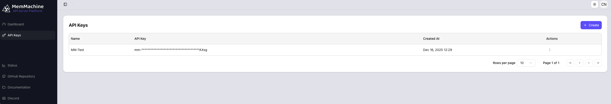
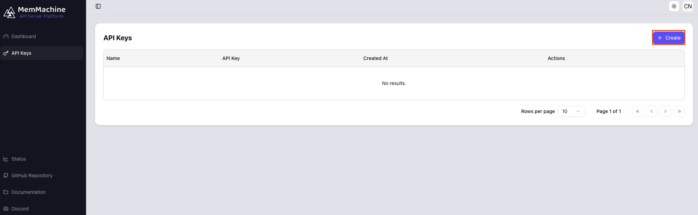
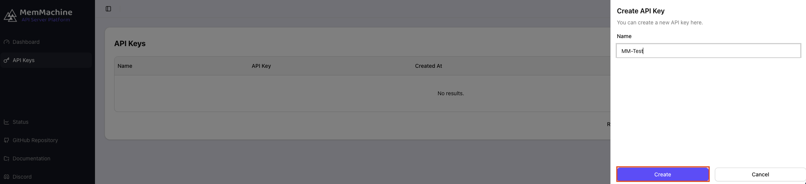
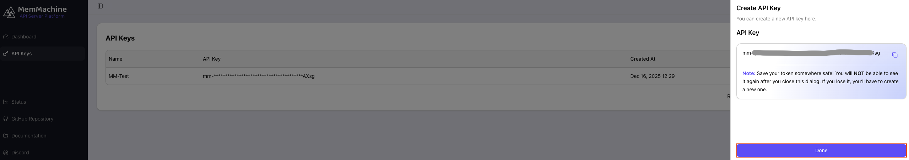

Welcome to the guide for managing your API Keys in the MemMachine Platform! This page provides clear instructions on how to **create** a new API key and how to **manage** your existing keys over time.

## Viewing and Managing Your API Keys

To review your existing API keys, navigate to the **API Keys** option in the left-hand menu. This will open the **API Keys Dashboard**, which displays a table containing all your registered keys. 

Below is a breakdown of the information presented in the API Key table:

| Element | Description |
| :--- | :--- |
| **Name** | A user-provided label for the key, useful for organizing and identifying its purpose. |
| **API Key** | The unique token for accessing the platform. The majority of the token is masked by asterisks for security. |
| **Created At** | The date and time when the API Key was initially generated. |
| **Actions** | Contains a vertical ellipsis (`...`). Clicking this reveals the **Delete** option, allowing you to revoke and remove the API key. |

## Creating a New API Key

Follow these steps to generate a new API key for your MemMachine Platform usage:

<Steps>
<Step title="Step 1: Click the 'Create' Button">
To start generating a new key, click the **+ Create** button located on the right side of the API Keys Dashboard. 

Clicking this button will cause a new panel titled "Create API Key" to slide in from the right side of your browser.
</Step>
<Step title="Step 2: Name Your Key and Confirm Creation">
In the "Create API Key" panel, provide a descriptive **Name** for your key (for example, "MM-Test" as shown below). Once named, click the **Create** button.

</Step>
<Step title="Step 3: Securely Record the Token">
You will immediately be shown your newly generated API Key and its complete token. 

<Note> **Crucial Security Step:** Please ensure you **copy the token immediately** and document it in a secure location outside of the Platform. For security reasons, you will **not** be able to view the full token again once this dialog is closed.</Note>

After you have securely recorded the token, click the **Done** button to close the panel and return to the API Keys Dashboard.

Congratulations! Your new API Key is now active and listed in the API Keys Dashboard table.
</Step>
</Steps>
