## Platform Overview

The MemMachine **Platform Dashboard** serves as your central hub for monitoring usage, accessing API Key information, and managing your account. Think of it as your console's home screen.

### Usage Monitoring (Graphs)

This section displays key metrics related to your **Platform** activity, including API call volume, processing time, and resource consumption. You'll see this area prominently featured: 
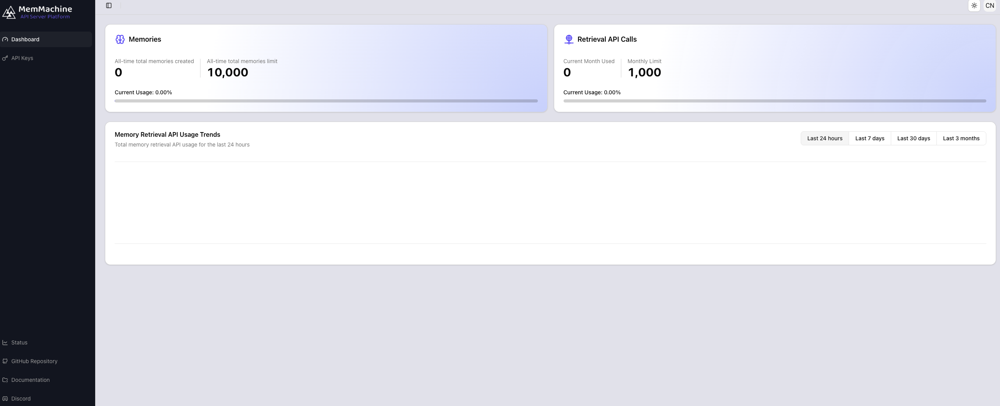

Since this is a new account, the graphs may initially appear empty, but don't worry!

<Tip>>Data will populate these graphs as soon as you begin making API calls using your generated API keys.</Tip>

The dashboard presents three separate graphs for Usage Monitoring:
 - **Memories** - the number of Memories you have created, adjacent to the current Memory Limit (10000 memories)
    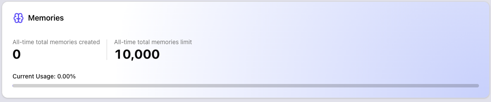
 - **Retrieval API Calls** - the number of API calls you have made, adjacent to the current API Call Limit (1000 memories)
    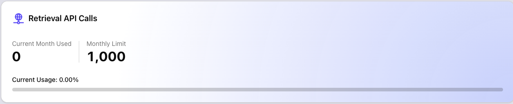
 - **Memory Retrieval API Usage Trends** - Usage trends grouped by the last 24 hours, the last 7 days, last 30 days, and last 3 months
    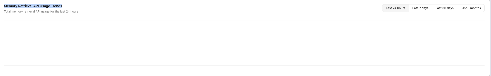

## Navigation and Controls

The **Platform** provides two main navigation areas: the **Left-Hand Menu** for primary feature access and the **Top Menu Bar** for account-specific actions.

### Left-Hand Menu (Primary Features and Links)

Use this menu to quickly navigate between core areas of the **Platform**:

| Link Name | Image | Description |
| :--- | :--- | :--- |
| **Dashboard** |   | Returns you to this main overview screen. |
| **API Keys** | 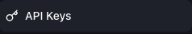   | Where you can create and monitor API Key access and usage. |
| **Status** | 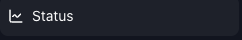  | Links to the [MemMachine Status site](https://status.memmachine.ai), showing current and past information on MemMachine Server uptimes and outages. |
| **GitHub Repository** | 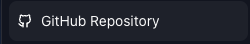   |  Links to the [MemMachine GitHub Repository](https://github.com/MemMachine/MemMachine). |
| **Documentation** | 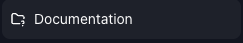  | Links to the full [MemMachine documentation suite](https://docs.memmachine.ai). |
| **Discord** | 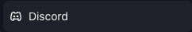   | Links to the [MemMachine Discord Server](https://discord.gg/usydANvKqD)|

### Top Menu Bar (Account and Screen Settings)

The top-right corner of the dashboard provides quick access to essential account features, detailed below:

<Accordion title="Screen Settings">
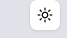
Clicking the **Sun Icon** shown above reveals a panel that allows you to choose between Light, Dark, and System settings for viewing the Platform Page.  

Below is an image of the panel that is shown:
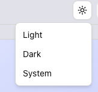
</Accordion>

<Accordion title="Account and Settings ( CN Icon)">

Clicking the **CN Icon** (shown above) opens a drop-down menu showing you the account you're logged in as, and an option to Log Out:
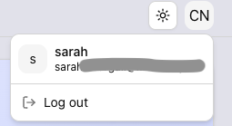

</Accordion>