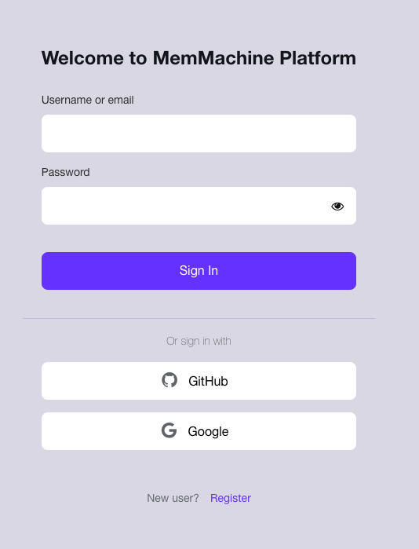
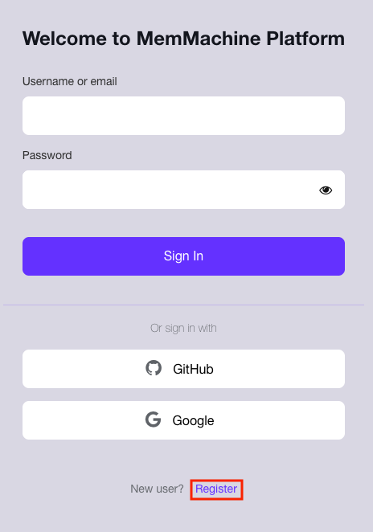
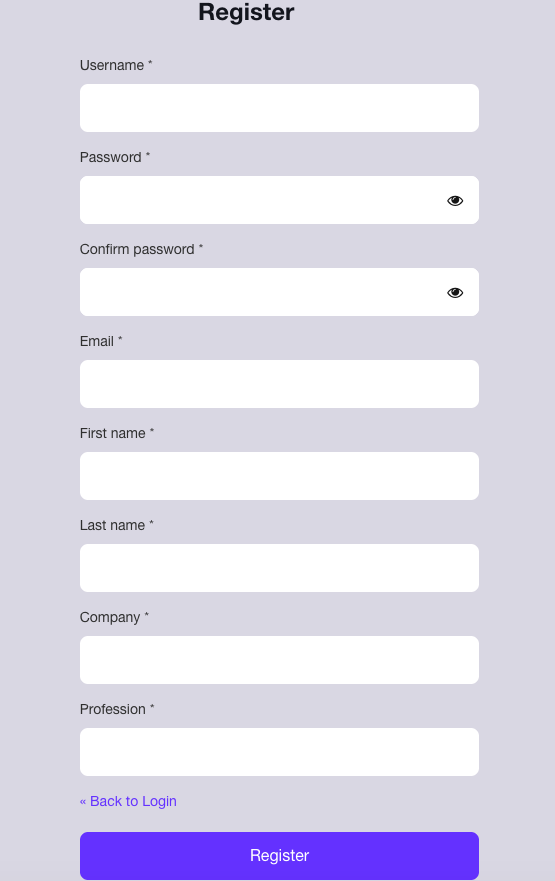
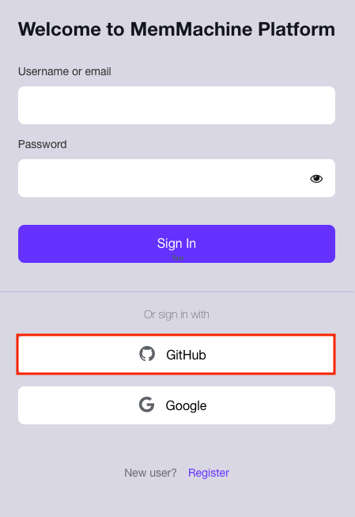
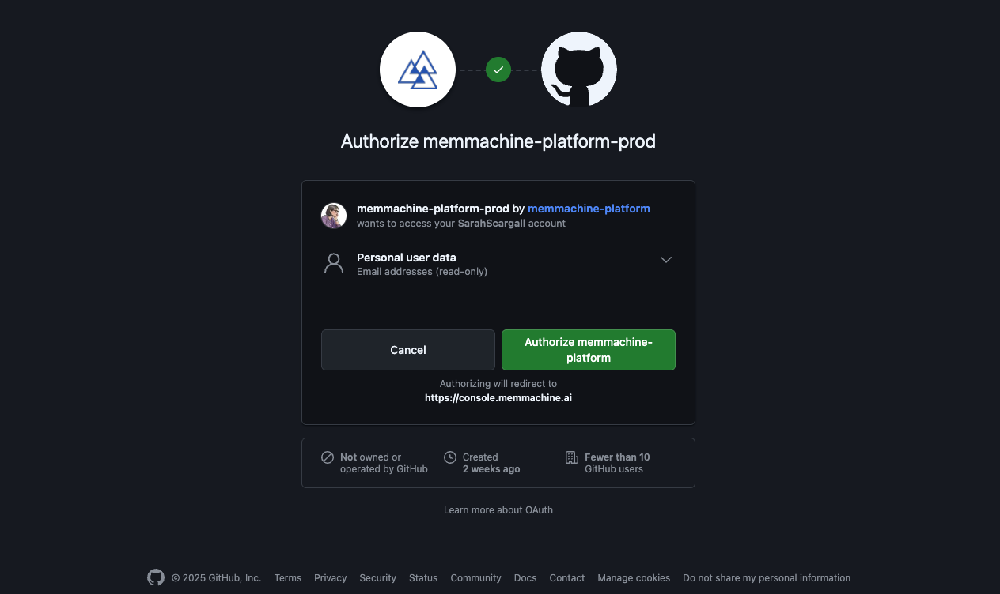
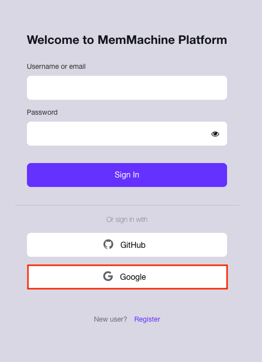
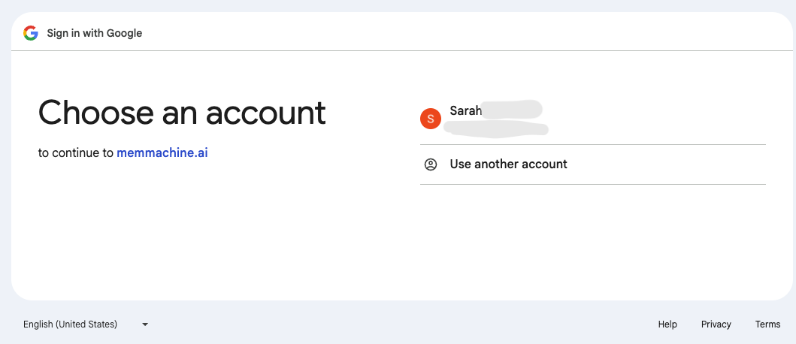
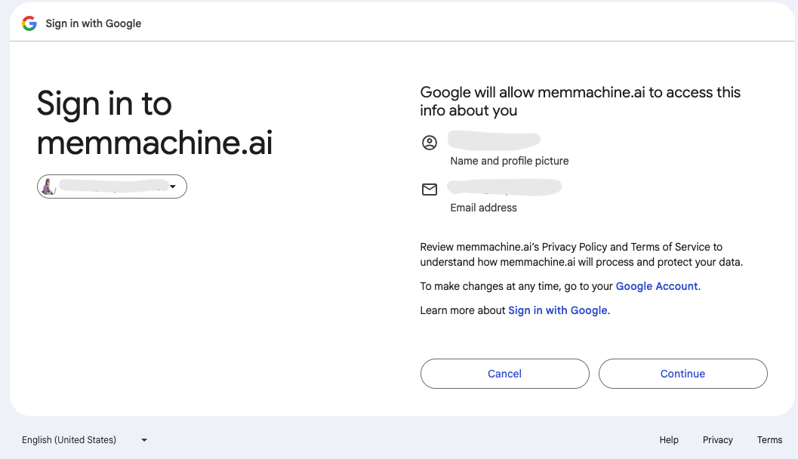
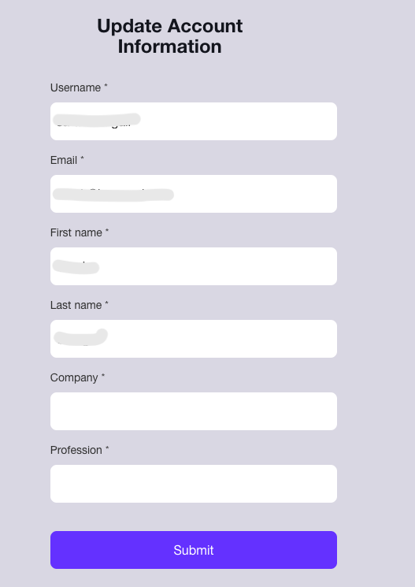

Welcome to the **MemMachine Platform User Guide**! This page provides step-by-step instructions on how to **register** for a new account and **log in** to the MemMachine Platform.

### Accessing the Platform

Navigate to the MemMachine Platform URL (e.g., `https://console.memmachine.ai`) in your web browser. You will be presented with the primary **Login** screen:

---

## New User Registration

If you are a new user, you must first register for an account using one of the three available methods: **Username/Email**, **GitHub**, or **Google Authorization**.

<Tabs>
<Tab title="Username or Email" icon="user">
<Steps>
<Step title="Start the Registration Process">
On the main login screen, click the **Register** link located at the bottom of the form.

</Step>
<Step title="Complete the Registration Form">
Fill out all fields marked with an asterisk (**\***) on the Registration form.

After completing the required fields, click the blue **Register** button to finalize your registration. You will then be automatically directed to the **MemMachine Platform Console**.
</Step>
</Steps>
</Tab>
<Tab title="GitHub" icon="github">
<Steps>
<Step title="Initiate GitHub Login">
On the login screen, click the **GitHub** button to log in using your existing GitHub account credentials.

</Step>
<Step title="Authorize GitHub Access">
You will be redirected to a GitHub Authorization page. This page requests authorization to link the MemMachine Platform with your GitHub account.

</Step>
<Step title="Complete Authorization and Update Account">
Click the bright green **Authorize memmachine-platform** button.

You will be taken to the **MemMachine Account Update Form**. This form pre-populates some information from your GitHub profile and requires you to enter your **Company** and **Profession**.

<Note>GitHub will send you an email confirmation regarding this authorization: "A third-party OAuth application (memmachine-platform-prod) with user:email scopes was recently authorized to access your account."</Note>

Once you have completed the form, click the **Submit** button. Registration will be complete, and you will be directed to the **MemMachine Platform Console**.
</Step>
</Steps>
</Tab>
<Tab title="Google Authorization" icon="google">
<Steps>
<Step title="Initiate Google Login">
Click the **Google** button on the login screen (highlighted in the image below) to begin registration via your Google account.

</Step>
<Step title="Select Your Google Account">
Choose the Google Account you wish to use for logging into the MemMachine Platform.

Click on the desired account. The background will briefly turn light blue to indicate your selection.
</Step>
<Step title="Confirm Google Authorization">
Google will display a secondary Authorization Verification page.

If the displayed account is correct, click the **Continue** button.
</Step>
<Step title="Verify and Complete Account Information">
You will be redirected back to the MemMachine Platform to the **Account Update Form**. This step verifies your account information and completes the registration process.

Fill out all required fields (**\***) and click the **Submit** button to finalize your registration.
</Step>
</Steps>
</Tab>
</Tabs>
---

## User Login

Once your account is registered, you can log in directly using the method you established during registration (Username/Email, GitHub, or Google). Simply return to the main login screen and enter your credentials or click the appropriate third-party login button.
