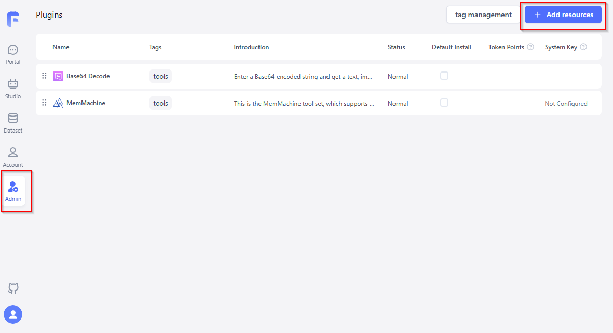

# FastGPT Integration with MemMachine

This directory contains a toolset package that enables integration of MemMachine memory operations into FastGPT workflows.

## Overview

MemMachine provides a toolset that integrates with FastGPT workflows, enabling AI agents to have persistent memory capabilities. This allows agents to retain past interactions, user preferences, and context across multiple sessions.

## Installation

1. Install FastGPT by following the [official documentation](https://doc.fastgpt.io/).
2. Log in to the FastGPT GUI using the root user.
3. Go to the admin page.
   
4. [Download the MemMachine toolset package](pkgs/memmachine.pkg)
5. Click the "Add resources" button and select "Import/update resources".
6. Choose the MemMachine toolset package to upload.
7. After verifying the file information, click "Confirm import".

## Available Tools

### 1. Store Memory

Store important information about the user or conversation into memory.

**Parameters**

| Parameter   | Type           | Default                  | Description                                           |
| ----------- | -------------- | ------------------------ | ----------------------------------------------------- |
| orgId       | string         | universal                | Unique identifier for the organization                |
| projectId   | string         | universal                | Unique identifier for the project                     |
| types       | multipleSelect | ['episodic', 'semantic'] | Memory types; leave empty to add to all types         |
| content     | string         | -                        | **Required** Memory content to store                  |
| producer    | string         | user                     | Sender of the memory content                          |
| producedFor | string         | -                        | Recipient of the memory content                       |
| timestamp   | string         | -                        | Creation time of the memory content (ISO 8601 format) |
| role        | string         | -                        | Role of the memory content in the conversation        |
| metadata    | string         | -                        | Additional memory attributes (in JSON format)         |

**Output**

```json
{
  "memoryId": "New memory ID"
}
```

### 2. Search Memory

Retrieve relevant context, memories, or profile for a user.

**Parameters**

| Parameter       | Type           | Default                  | Description                                              |
| --------------- | -------------- | ------------------------ | -------------------------------------------------------- |
| orgId           | string         | universal                | Unique identifier for the organization                   |
| projectId       | string         | universal                | Unique identifier for the project                        |
| types           | multipleSelect | ['episodic', 'semantic'] | Memory types; leave empty to search all types            |
| query           | string         | -                        | **Required** Natural language query for memory retrieval |
| limit           | number         | 10                       | **Required** Maximum number of search results            |
| filter          | string         | -                        | Condition to filter memories                             |
| contextTemplate | string         | default template         | Template for building memory context                     |

**Output**

```json
{
  "memoryContext": "memory context"
}
```

## References

- [FastGPT document](https://doc.fastgpt.io/)
- [FastGPT System tool development guide](https://doc.tryfastgpt.ai/docs/introduction/guide/plugins/dev_system_tool)
- [MemMachine document](https://docs.memmachine.ai/)
- [MemMachine API document](https://api.memmachine.ai/docs)
