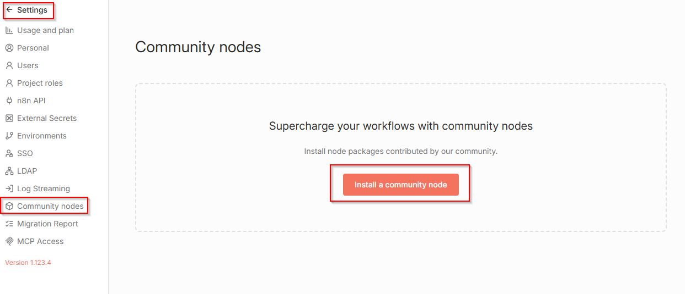
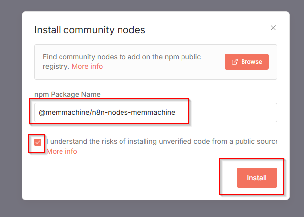
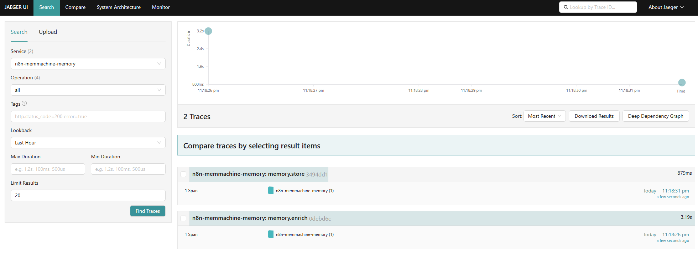

# n8n Integration with MemMachine

This directory explains how to integrate MemMachine memory operations into n8n workflows. It provides guidance on using MemMachine’s nodes within n8n.

## Overview

MemMachine provides custom nodes that integrate with n8n workflows, enabling AI agents to have persistent memory capabilities. This allows agents to retain past interactions, user preferences, and context across multiple sessions.

## Installation

### Community Nodes

To add MemMachine’s community nodes from npm to an existing n8n instance:

1. Go to **Settings > Community Nodes**.
2. Select **Install a community node**.

   

3. Enter `@memmachine/n8n-nodes-memmachine` in **npm Package Name**.
4. Agree to the [risks](https://docs.n8n.io/integrations/community-nodes/risks/) of using community nodes: select **I understand the risks of installing unverified code from a public source**.
5. Select **Install**.

   

### Docker Installation

To run a self-hosted n8n instance with MemMachine’s nodes pre-installed:

1. Go to the [MemMachine n8n integration repository](https://github.com/MemMachine/n8n-nodes-memmachine) and clone it.
2. Start n8n with MemMachine’s nodes:

```bash
# Start n8n and Jaeger
docker-compose up -d

# View logs
docker-compose logs -f
```

3. Access services:

- n8n UI: http://localhost:5678
- Jaeger UI: http://localhost:16686

4. Stop n8n instance:

```bash
# Stop services
docker-compose down
```

5. Refer to the [README.md](https://github.com/MemMachine/n8n-nodes-memmachine/blob/main/README.md) for detailed usage instructions.

## Available Nodes

MemMachine offers two n8n nodes: the Main Node (MemMachine Manager) and the AI Memory Node (MemMachine Memory).

### Main Node (MemMachine Manager)

The Main Node provides two actions: Store a message and Enrich with context.

- **Store a message**

  Save conversational messages to MemMachine.

  **Parameters**

  | Parameter      | Type    | Default | Description                                                         |
  | -------------- | ------- | ------- | ------------------------------------------------------------------- |
  | orgId          | string  | -       | **Required.** Unique organization identifier.                       |
  | projectId      | string  | -       | **Required.** Unique project identifier.                            |
  | producer       | string  | -       | **Required.** Who created this message.                             |
  | producedFor    | string  | -       | **Required.** Intended recipient of the message.                    |
  | episodeContent | string  | -       | **Required.** The message content to store.                         |
  | episodeType    | options | dialog  | Type of episode. Possible options: dialog, summary, or observation. |
  | metadata       | json    | {}      | Additional metadata to associate with the message.                  |
  | groupId        | string  | default | **Required.** Unique group identifier.                              |
  | agentId        | string  | -       | **Required.** Unique AI agent identifier.                           |
  | userId         | string  | user_v1 | **Required.** Unique user identifier.                               |

  **Output**

  ```json
  {
    "results": [
      {
        "uid": "New memory ID"
      }
    ]
  }
  ```

- **Enrich with context**

  Retrieve historical context from MemMachine and enrich AI agent responses.

  **Parameters**

  | Parameter       | Type    | Default            | Description                                                                |
  | --------------- | ------- | ------------------ | -------------------------------------------------------------------------- |
  | orgId           | string  | -                  | **Required.** Unique organization identifier.                              |
  | projectId       | string  | -                  | **Required.** Unique project identifier.                                   |
  | query           | string  | -                  | **Required.** Natural language query used to search for relevant memories. |
  | limit           | number  | 50                 | Maximum number of results to return.                                       |
  | filterBySession | boolean | true               | Whether to restrict results to the current session context.                |
  | filter          | json    | {}                 | Additional JSON filter to further refine memory search results.            |
  | groupId         | string  | default            | **Required.** Unique group identifier.                                     |
  | agentId         | string  | -                  | **Required.** Unique AI agent identifier.                                  |
  | userId          | string  | user_v1            | **Required.** Unique user identifier.                                      |
  | enableTemplate  | boolean | true               | Whether to render a formatted context template using categorized memories. |
  | contextTemplate | string  | `default template` | Markdown template for formatting the memory context.                       |

  > `default template` refers to the system’s built-in context template. Users may override it with a custom template.

  **Output**

  ```json
  {
    "episodic_memory": "All episodic memories, including short-term and long-term",
    "shortTermMemory": "Short-term episodic memory results",
    "longTermMemory": "Long-term episodic memory results",
    "semantic_memory": "All semantic memory results",
    "context": "Formatted memory context generated from search results",
    "totalResults": "Total number of episodic memory results",
    "apiResponse": "Raw response data from the MemMachine Search API"
  }
  ```

### AI Memory Node (MemMachine Memory)

The AI Memory Node connects directly to the AI agent’s memory port in n8n workflows, enabling advanced memory operations and seamless integration with AI agent tools for managing conversational context.

**Parameters**

| Parameter             | Type    | Default            | Description                                                                                      |
| --------------------- | ------- | ------------------ | ------------------------------------------------------------------------------------------------ |
| orgId                 | string  | -                  | **Required.** Unique organization identifier.                                                    |
| projectId             | string  | -                  | **Required.** Unique project identifier.                                                         |
| contextWindowLength   | number  | 10                 | Maximum number of recent messages to include in the conversation history.                        |
| enableMemoryTemplate  | boolean | false              | Whether to format the memory context using a template.                                           |
| memoryContextTemplate | string  | `default template` | Template for formatting the memory context.                                                      |
| historyCount          | number  | 5                  | Number of recent episodic memories to include when formatting the memory context.                |
| shortTermCount        | number  | 10                 | Number of additional short-term episodic memories to include when formatting the memory context. |

> `default template` refers to the system’s built-in memory context template. Users may override it with a custom template.

**Conversation History Output**

- When `enableMemoryTemplate` is false (default, returns only chat history):

  ```json
  {
    "chat_history": "Array of episodic memories (short-term and long-term), limited by contextWindowLength"
  }
  ```

- When `enableMemoryTemplate` is true (returns chat history with formatted context):

  ```json
  {
    "chat_history": [
      {
        "content": "Formatted memory context"
      }
    ]
  }
  ```

## Nodes Tracing

MemMachine’s nodes include tracing capabilities for debugging and monitoring, which can be configured through node parameters.

**Parameters**

| Parameter          | Type    | Default                      | Description                                                                    |
| ------------------ | ------- | ---------------------------- | ------------------------------------------------------------------------------ |
| tracingEnabled     | boolean | false                        | Whether to enable operation tracing.                                           |
| traceFormat        | options | json                         | Format for trace output. Possible options: json or human.                      |
| traceVerbosity     | options | normal                       | Level of detail in trace output. Possible options: minimal, normal or verbose. |
| exportToJaeger     | boolean | false                        | Whether to send traces to Jaeger.                                              |
| jaegerOtlpEndpoint | string  | http://jaeger:4318/v1/traces | Jaeger OTLP HTTP endpoint URL.                                                 |

**Jaeger UI**

The following snapshot shows an example of tracing in the Jaeger UI.


## References

- [MemMachine n8n integration repository](https://github.com/MemMachine/n8n-nodes-memmachine)
- [n8n Documentation](https://docs.n8n.io/)
- [n8n Community Nodes Installation](https://docs.n8n.io/integrations/community-nodes/installation/)
- [MemMachine Documentation](https://docs.memmachine.ai/)
- [MemMachine API Documentation](https://api.memmachine.ai/docs)
